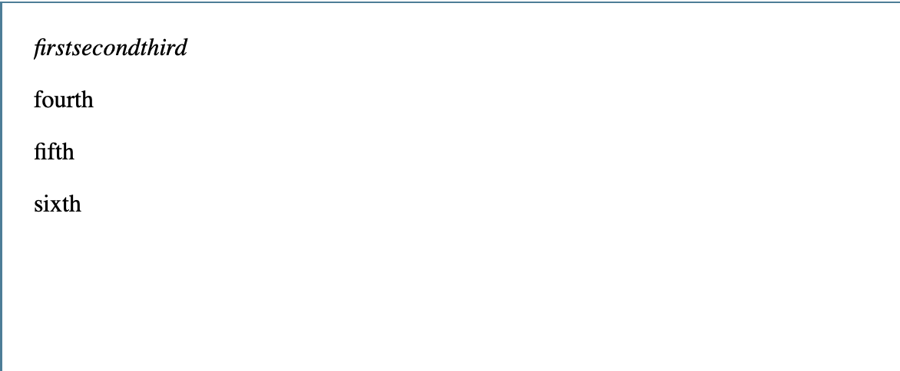

**These Notes are not my own, I have paraphrased and edited some points for readability, however the complete and much thorough documentation can be found on Mozilla's Website: [Mozilla's HTML Documentation](https://developer.mozilla.org/en-US/docs/Learn/CSS/Building_blocks/The_box_model#Types_of_CSS_boxes)**
# HTML is Not a programming language
**It is a Markup language telling browsers:**
  * how to structure websites
  * ex. My cat is very grumpy is 'Marked Up' with the `<p>` tag `<p>`My cat is very grumpy`</p>` and the browser outputs:
      <p>My Cat is very grumpy</p>
## Block Level Elements Vs Inline
  ### **Block-Level Elements** form a visible block on a page 
  * appear on a new line
  * structural elements on the page
    * paragraphs lists navigation menus footers etc
  * **block level element wouldnt be nested inside an inline element but it might be nested inside a block element**
  ### **Inline Elements** are those contained *within block-level elements* and surround small parts of the document
  * An inline element will **not** cause a new line to appear in the document
  * Normally appears inside paragraph of text:
    * Ex: *using the em tag and p tag* 
          *  *em:*
            * `<em>first</em><em>second</em><em>third</em>`
          *  *p:*
            * `<p>fourth</p><p>fifth</p><p>sixth</p>`
      * `<em></em>` is an inline element while `<p></p> ` is a block element
      * 
  ### Note: HTML5 Redifned Element Categories Source:[Element Categories](https://html.spec.whatwg.org/multipage/indices.html#element-content-categories)

  ### Note: "block" and "inline" are not the same as types of CSS boxes display:block; display:inline;.
  * **Even though they correlate it DOES NOT change which elements it can contain and which elements it can be contained in**
  * **[Types Of CSS Boxes](https://developer.mozilla.org/en-US/docs/Learn/CSS/Building_blocks/The_box_model#Types_of_CSS_boxes)**
  * ***This is why HTML5 drops these terms to prevent confused coders***
  ### Note: Useful reference pages for block & inline Elements.
  * **[Block Elements](https://developer.mozilla.org/en-US/docs/Web/HTML/Block-level_elements)**
  * **[Inline Elements](https://developer.mozilla.org/en-US/docs/Web/HTML/Inline_elements)**

## Empty Elements:
Not all elements follow an opening tag, content, and closing tag (although most do). Some elements consist of a single tag
 
**Look at this example of embedded an image to understand better:**

 ```html 
   
 ```
**Output**:
  

## Attributes
Elements contain attributes which look like:
[Mozilla Attribute Example](images/mozilla-attributes.png)
These attributes contain information you want to use but not appear on the browser such as **id**,**class**,**target**, etc.
Attributes consist of:
  * space between it and element name
  * attr name followed by = 'class='
  * attr value 'class=my-class'
Using the `<a>` tag to link my most used site in a new window with attributes:
```html
    <a href="http://stackoverflow.com" target="_blank" rel="noopener noreferrer">My Most Used Site</a>
```
*if you are unfamiliar with these look them up on the website I linked *<a href="http://stackoverflow.com" target="_blank" rel="noopener noreferrer">HERE</a>

## Boolean Attributes
Boolean attributes can only have **one** value which is typically the same as the attribute name. The [disabled](https://developer.mozilla.org/en-US/docs/Web/HTML/Element/input#attr-disabled) attribute greys out form elements so the user cannot enter data in them using a boolean attribute.

```html
  <input type="text" disabled="disabled">
```
You can also write this in shorthand like this:

```html
  <!-- using the disabled attribute prevents the end user from entering text into the input box -->
<input type="text" disabled>

<!-- The user can enter text into the follow input, as it doesn't contain the disabled attribute -->
<input type="text">  
```
## Single or double quotes for attributes?
Answer: whichever you prefer as long as you dont **mix them together**
I like to use double quotes on attributes just incase I need quotes inside to avoid having to add ugly syntax which I wont talk about further

## Best Practice:
  * **Use all tags in lowercase such as `<p>` & `<em` insead of `<P></p> or <P></P>`**

# Anatomy of an HTML document
**Basic Page Structure**
```html
<!DOCTYPE html>
<html lang="en">
<head>
  <meta charset="UTF-8">
  <meta name="author" content="Gecko">
  <meta name=”description” content="This is an example of a simple page structure you can use as an outline">
  <meta name=”viewport” content=”width=device-width,initial-scale=1″>
  <title>Web Developer</title>
  <link rel="stylesheet" href="./styles/style.css">
  <script src="./js/script.js"></script>
</head>
<body>
  <!-- EXAMPLE of a comment you should fill code with to explain, I wont here -->
  <div class="wrapper">

    <header class="main-head">
      <h1 class="site-title">Something To Do Later</h1>
    </header>

    <nav class="nav-bar">
      <ul class="simple-list">
        <li class="list-item"><a class="link-item" href="">First Link</a></li>
        <li class="list-item"><a class="link-item" href="">Second Link</a></li>
        <li class="list-item"><a class="link-item" href="">Third Link</a></li>
      </ul>
    </nav>
    
    <article class="article-1">
      <h2 class="article-header">An Interesting H2</h2>
      <p class="article-p">Ipsum autem facere id est perferendis. Molestias earum odio voluptatibus quam earum totam Quasi alias ad deleniti odio repellat? Consequuntur temporibus repudiandae itaque numquam reiciendis recusandae ut ex quia? Provident?</p>
    </article>

    <aside class="sidebar">
      <h3 class="sidebar-head">Nothing Important Here</h3>
    </aside>

    <aside class="ads">
      <h3 class="ad">Ads Go Here</h3>
    </aside>

    <footer class="main-footer">
      <h4 class="footer-header">Small Footer</h4>
    </footer>
  </div>  
</body>
</html>
```
**Structure Breakdown**
1. `<!DOCTYPE html>`: used to act as links to a set of rules that the HTML page had to follow, way before HTML5 or XML.
  1. `<!DOCTYPE html>` is a short and sweet valid doctype to let your browser know this is an html document
2. `<html></html>`: Wraps all the content on the entire page and sometimes referred to as the **root element**
3. `<head></head>` Acts as a container for everything included on your HTML page that *isn't* showed to the user. 
  1. Includes things like keywords, page descriptions, titles, links to css and javascript files, and more
4. `<meta charset="utf-8">`: Specifies the character set for your document. **Do not omit this**
5. `<title></title>`: Sets the title of your page, appears in browser tab, search engines, and bookmarks
6. `<body></body>`: Contains *all* content that you are showing the user.

## Whitespace is redundant in HTML
No matter how much whitespace is used the HTML parser reduces it to **one single space when rendering the code

## Entity References: Including Special Characters in HTML
** <, >, ", and & are special characters because they **are apart of the HTML syntax itself**
Use this table to include one in your text
[Mozilla Table](images/mozilla-table.png)
Example:
```html
  <p>In HTML, you define a paragraph using the <p> element.</p>

  <p>In HTML, you define a paragraph using the &lt;p&gt; element.</p>
```
notice how the first makes element a new paragraph and leaves one open p tag, where as the second turns this into text of the only p tag registered.

><p>In HTML, you define a paragraph using the <p> element.</p>

><p>In HTML, you define a paragraph using the &lt;p&gt; element.</p>

## HTML Comments
I will not explain this as well because it is pretty self explanatory. Comment something for your or another developers eyes but not display it on the actual page (sort of)
```html
  <p>I'm not inside a comment</p>

  <!-- <p>I am!</p> -->
```
Output:
><p>I'm not inside a comment</p>

<!-- <p>I am!</p> -->
Only I'm not inside a comment is shown.

# Sitelinks & Meta Data

[Sitelinks](images/sitelinks.png)

Sitelinks are the links listed below the main page link, you can configure these in [Google Webmaster Tools](https://www.google.com/webmasters) and improves your search results **highly recommend**

*Note: many meta features are not used anymore such as 'meta name="keywords" content="fill,in,keywords"' this is ignored by search engines now due to spammers

## [Open Graph Data](https://ogp.me)

Look at [Mozillas Doc Source Code](https://developer.mozilla.org/en-US/docs/Learn/HTML/Introduction_to_HTML/The_head_metadata_in_HTML) and find:
```html
  <meta property="og:image" content="https://developer.cdn.mozilla.net/static/img/opengraph-logo.dc4e08e2f6af.png">
  <meta property="og:description" content="The Mozilla Developer Network (MDN) provides
  information about Open Web technologies including HTML, CSS, and APIs for both Web sites
  and HTML5 Apps. It also documents Mozilla products, like Firefox OS.">
  <meta property="og:title" content="Mozilla Developer Network">
```
This gives the facebook user a better user experience when sharing a link to the site on facebook

[Mozilla Facebook](images/facebook-moz.png)

Twitters proprietary metadata called [Twitter Cards](https://developer.twitter.com/en/docs/tweets/optimize-with-cards/overview/abouts-cards)

```html
<meta name="twitter:title" content="Mozilla Developer Network">
```
## Adding Custom Icons
Adding custom icons to your site makes your site look more professional and enriches your site design

Types of icons you can add
1. Favicon
  1. 16 px square icon used in browser tab and bookmarks
  2. Add Favicon By:
    1. Saving it in the same directory as sites index page saved in .ico format
    2. add this link in the `<head>` of your index.html
    ```html
    <link rel="icon" href="favicon.ico" type="image/x-icon">
    ```
## Applying CSS and JavaScript to HTML
**CSS is used to style the website and JavaScipt can be used for a multitude of things, now we will focus on its ability to add interactions to the website**

## Convention for linking Images, JavaScript, and CSS files
It is best practice to store images, js, and css in their own folder for organization, this can go deeper but for now use this as a template
[Site Structure](images/structure.png)

Linking CSS and JS in your index.html is done by:
```html
  <link rel="stylesheet" href="./styles/main.css">
  <script src="./js/script.js"></script>
```
## Setting The Primary Language
You should always do this for indexing, seo, and people with visual impairments
```html
  <html lang="en-US">
```
Subset of language inside your html doc:
```html
  <p>Japanese example: <span lang="ja">ご飯が熱い。</span>.</p>
```

# Semantics

One of HTML's main functions is to give the content structure and meaning (known as semantics) for the browser.

## Headings and Paragraphs
Headings (h1-h6) and paragraphs give you access to structure similar to a newspaper

```html
  <h1>I Am a Heading</h1>
  <p>I am a paragraph</p>
```
### Implementing structural hierarchy
```html
<!-- only have one h1 per page for SEO -->
  <h1>h1</h1>
  <p>p</p>
  <h2>h2</h2>
  <p>p</p>
  <h3>h3</h3>
  <p>p</p>
```
### Lists
```html
<ul>
  <li>milk</li>
  <li>eggs</li>
  <li>bread</li>
  <li>hummus</li>
</ul>
<ol>
  <li>Drive to the end of the road</li>
  <li>Turn right</li>
  <li>Go straight across the first two roundabouts</li>
  <li>Turn left at the third roundabout</li>
  <li>The school is on your right, 300 meters up the road</li>
</ol>
<ol>
  <li>Remove the skin from the garlic, and chop coarsely.</li>
  <li>Remove all the seeds and stalk from the pepper, and chop coarsely.</li>
  <li>Add all the ingredients into a food processor.</li>
  <li>Process all the ingredients into a paste.
    <ul>
      <li>If you want a coarse "chunky" hummus, process it for a short time.</li>
      <li>If you want a smooth hummus, process it for a longer time.</li>
    </ul>
  </li>
</ol>
```
### Description Lists
```html
<dl>
  <dt>soliloquy</dt>
  <dd>In drama, where a character speaks to themselves, representing their inner thoughts or feelings and in the process relaying them to the audience (but not to other characters.)</dd>
  <dt>monologue</dt>
  <dd>In drama, where a character speaks their thoughts out loud to share them with the audience and any other characters present.</dd>
  <dt>aside</dt>
  <dd>In drama, where a character shares a comment only with the audience for humorous or dramatic effect. This is usually a feeling, thought, or piece of additional background information.</dd>
</dl>
```

### Emphasis and Importance
```html
<p>This liquid is <strong>highly toxic</strong> —
if you drink it, <strong>you may <em>die</em></strong>.</p>
<p>
  The menu was a sea of exotic words like <i lang="uk-latn">vatrushka</i>,
  <i lang="id">nasi goreng</i> and <i lang="fr">soupe à l'oignon</i>.
</p>
<ol>
  <li>
    <b>Slice</b> two pieces of bread off the loaf.
  </li>
  <li>
    <b>Insert</b> a tomato slice and a leaf of
    lettuce between the slices of bread.
  </li>
</ol>
```
### Blockquote
```html
<blockquote cite="https://developer.mozilla.org/en-US/docs/Web/HTML/Element/blockquote">
  <p>The <strong>HTML <code>&lt;blockquote&gt;</code> Element</strong> (or <em>HTML Block
  Quotation Element</em>) indicates that the enclosed text is an extended quotation.</p>
</blockquote>
```
### Inline Quotes
```html
p>The quote element — <code>&lt;q&gt;</code> — is <q cite="https://developer.mozilla.org/en-US/docs/Web/HTML/Element/q">intended
for short quotations that don't require paragraph breaks.</q></p>
```
### Citations
```html
<p>According to the <a href="https://developer.mozilla.org/en-US/docs/Web/HTML/Element/blockquote">
<cite>MDN blockquote page</cite></a>:
</p>
```
### Abbreviations
```html
<p>We use <abbr title="Hypertext Markup Language">HTML</abbr> to structure our web documents.</p>

<p>I think <abbr title="Reverend">Rev.</abbr> Green did it in the kitchen with the chainsaw.</p>
```
### Contact
```html 
<address>
  <p>
    Chris Mills<br>
    Manchester<br>
    The Grim North<br>
    UK
  </p>

  <ul>
    <li>Tel: 01234 567 890</li>
    <li>Email: me@grim-north.co.uk</li>
  </ul>
</address>
```
### Subscript and Superscript
```html
<p>My birthday is on the 25<sup>th</sup> of May 2001.</p>
<p>Caffeine's chemical formula is C<sub>8</sub>H<sub>10</sub>N<sub>4</sub>O<sub>2</sub>.</p>
<p>If x<sup>2</sup> is 9, x must equal 3 or -3.</p>
```
### Code 
```html 
<pre><code>var para = document.querySelector('p');

para.onclick = function() {
  alert('Owww, stop poking me!');
}</code></pre>

<p>You shouldn't use presentational elements like <code>&lt;font&gt;</code> and <code>&lt;center&gt;</code>.</p>

<p>In the above JavaScript example, <var>para</var> represents a paragraph element.</p>


<p>Select all the text with <kbd>Ctrl</kbd>/<kbd>Cmd</kbd> + <kbd>A</kbd>.</p>

<pre>$ <kbd>ping mozilla.org</kbd>
<samp>PING mozilla.org (63.245.215.20): 56 data bytes
64 bytes from 63.245.215.20: icmp_seq=0 ttl=40 time=158.233 ms</samp></pre>
```
### Date and Time
```html
<time datetime="2016-01-20">20 January 2016</time>

```
or 
```html
<!-- Standard simple date -->
<time datetime="2016-01-20">20 January 2016</time>
<!-- Just year and month -->
<time datetime="2016-01">January 2016</time>
<!-- Just month and day -->
<time datetime="01-20">20 January</time>
<!-- Just time, hours and minutes -->
<time datetime="19:30">19:30</time>
<!-- You can do seconds and milliseconds too! -->
<time datetime="19:30:01.856">19:30:01.856</time>
<!-- Date and time -->
<time datetime="2016-01-20T19:30">7.30pm, 20 January 2016</time>
<!-- Date and time with timezone offset-->
<time datetime="2016-01-20T19:30+01:00">7.30pm, 20 January 2016 is 8.30pm in France</time>
<!-- Calling out a specific week number-->
<time datetime="2016-W04">The fourth week of 2016</time>
```

### Anatomy of a Link
```html
<p>I'm creating a link to
<a href="https://www.mozilla.org/en-US/"
   title="The best place to find more information about Mozilla's
          mission and how to contribute">the Mozilla homepage</a>.
</p>
```
**Block Level Links**
```html
<a href="https://www.mozilla.org/en-US/">
  
</a>
```
## Structuring Layout
Mozillas Reference Guide [here](https://developer.mozilla.org/en-US/docs/Web/HTML/Element)

## [Validate Your HTML](https://validator.w3.org)
