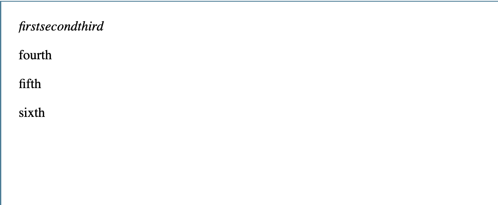

**These Notes are not my own, I have paraphrased and edited some points for readability, however the complete and much thorough documentation can be found on Mozilla's Website: [Mozilla's HTML Documentation](https://developer.mozilla.org/en-US/docs/Learn/CSS/Building_blocks/The_box_model#Types_of_CSS_boxes)**
# HTML is Not a programming language
**It is a Markup language telling browsers:**
  * how to structure websites
  * ex. My cat is very grumpy is 'Marked Up' with the `
` tag `
`My cat is very grumpy`
` and the browser outputs:
      
My Cat is very grumpy

## Block Level Elements Vs Inline
  ### **Block-Level Elements** form a visible block on a page 
    * appear on a new line
    * structural elements on the page
      * paragraphs lists navigation menus footers etc
    * **block level element wouldnt be nested inside an inline element but it might be nested inside a block element**
  ### **Inline Elements** are those contained *within block-level elements* and surround small parts of the document
    * An inline element will **not** cause a new line to appear in the document
    * Normally appears inside paragraph of text:
      * Ex: *using the em tag and p tag* 
            *  *em:*
              * `<em>first</em><em>second</em><em>third</em>`
            *  *p:*
              * `
fourth

fifth

sixth
`
        * **em** is an inline element while **p** is a block element
        * 
  ### Note: HTML5 Redifned Element Categories Source:[Element Categories](https://html.spec.whatwg.org/multipage/indices.html#element-content-categories)

  ### Note: "block" and "inline" are not the same as types of CSS boxes display:block; display:inline;.
  * **Even though they correlate it DOES NOT change which elements it can contain and which elements it can be contained in**
  * **[Types Of CSS Boxes](https://developer.mozilla.org/en-US/docs/Learn/CSS/Building_blocks/The_box_model#Types_of_CSS_boxes)**
  * ***This is why HTML5 drops these terms to prevent confused coders***
  ### Note: Useful reference pages for block & inline Elements.
    * **[Block Elements](https://developer.mozilla.org/en-US/docs/Web/HTML/Block-level_elements)**
    * **[Inline Elements](https://developer.mozilla.org/en-US/docs/Web/HTML/Inline_elements)**

## Best Practice:
  * **Use all tags in lowercase such as `
` & `<em`**
 